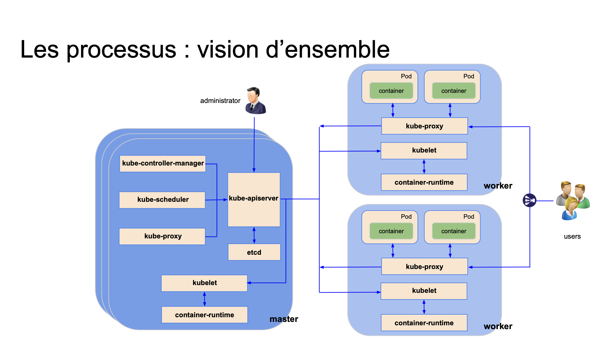
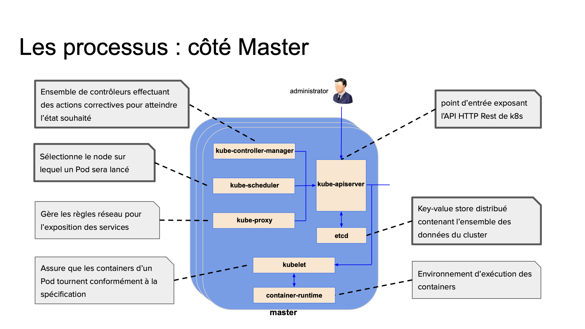
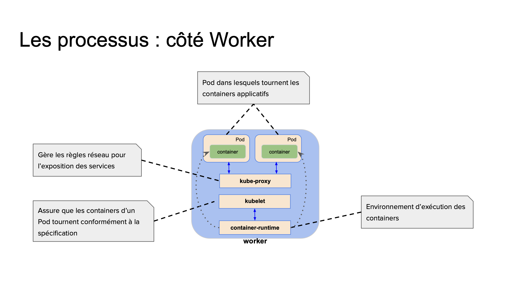
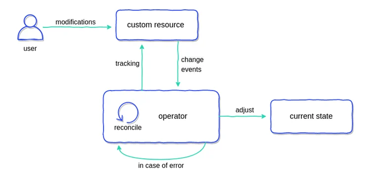

<!-- _class: lead -->
<!-- _paginate: false -->

# Kubernetes avancée

---

## Sommaire

<div class="columns">

<div>

<div style="font-size:35px">

1. **Rappel sur Kubernetes**
   - C'est quoi.
   - Les composantes.
   - Son fonctionnement
  
</div>  
</div>

<div>

<div style="font-size:33px">

2. **Les extensions**
   - CRD
   - Operateur 
   - Aggregation Layer
   - Admission Controller
   - Dynamic Admission Controller
   - Scheduler Extender
   - Custom Controller
  
  </div>
</div>

</div>

</div>

--- 
## Sommaire
<div style="font-size:40px">

3. **Helm**
   - C'est quoi.
   - App/lib charts, subcharts, dependencies
   - Pre & post actions/hooks
   - Tester une chart
   - Troubleshooting Helm
  
<div>

--- 


<!-- _class: lead -->
<!-- _paginate: false -->

## Rappel sur Kubernetes

---

## Rappel sur Kubernetes

#### C'est quoi ?
<br/>

<div style="font-size:35px">

Kubernetes est une plateforme open-source de gestion de conteneurs qui automatise le déploiement, la mise à l'échelle et les opérations des applications conteneurisées. 

 ---

## Rappel sur Kubernetes

#### Vue d'ensemble de Kubernetes
<br>

<div style="font-size:27px">

Kubernetes fonctionne en orchestrant un cluster de machines (physiques ou virtuelles) pour exécuter des conteneurs. Chaque cluster Kubernetes comporte les éléments suivants :
- **Master Node** : Gère l'état souhaité du cluster, orchestre les conteneurs et coordonne les nœuds de travail.
- **Worker Nodes** : Exécutent les applications conteneurisées et sont gérés par le nœud maître.

---

## Rappel sur Kubernetes

#### Composantes principales de Kubernetes


#### Master Node
<div style="font-size:25px">

1. **API Server** : Point d'entrée principal pour toutes les commandes de l'utilisateur. Il expose l'API Kubernetes.
2. **etcd** : Stockage clé-valeur hautement disponible utilisé comme base de données pour stocker toutes les données de configuration de Kubernetes.
3. **Scheduler** : Attribue les conteneurs aux nœuds de travail en fonction de la disponibilité des ressources et des exigences spécifiées.
4. **Controller Manager** : Exécute les contrôleurs qui surveillent l'état du cluster et apportent des modifications pour atteindre l'état souhaité (ex. : ReplicaSet, Deployment, Job).

---
## Rappel sur Kubernetes

#### Composantes principales de Kubernetes


<center>



</center>


---

## Rappel sur Kubernetes

#### Composantes principales de Kubernetes


#### Worker Nodes
<div style="font-size:26px">

1. **Kubelet** : Agent qui s'exécute sur chaque nœud de travail et garantit que les conteneurs sont exécutés dans un pod. Il surveille les conteneurs et les maintient en état de marche.
2. **Kube-proxy** : Implémente les règles réseau sur chaque nœud pour permettre la communication entre les services et les pods.
3. **Container Runtime** : Logiciel utilisé pour exécuter les conteneurs (par exemple, Docker, containerd).

---

## Rappel sur Kubernetes

#### Composantes principales de Kubernetes


<center>



</center>


---

## Rappel sur Kubernetes

#### Composantes principales de Kubernetes


<center>



</center>


---

## Rappel sur Kubernetes

### Composantes avancées de Kubernetes
<div style="font-size:25px">

#### Pods

- **Pod** : Unité de base de déploiement dans Kubernetes, un pod encapsule un ou plusieurs conteneurs partageant le même réseau et le même espace de stockage.

#### Services

- **Service** : Abstraction qui définit une politique d'accès pour exposer une application exécutée sur un ensemble de pods. Les services permettent de découvrir et de faire correspondre les pods.

#### Volumes

- **Volume** : Utilisé pour stocker des données persistantes. Contrairement aux conteneurs éphémères, les volumes peuvent survivre aux redémarrages des pods.
</div>

---

## Rappel sur Kubernetes

### Composantes avancées de Kubernetes

<br>

#### ConfigMaps et Secrets

<div style="font-size:30px">

- **ConfigMap** : Permet de découpler les configurations environnementales des conteneurs.
- **Secret** : Similaire à ConfigMap, mais destiné à stocker des données sensibles comme des mots de passe, des clés API, etc.

</div>

---

## Rappel sur Kubernetes

### Composantes avancées de Kubernetes

#### Controllers

<div style="font-size:25px">

- **ReplicationController** et **ReplicaSet** : Maintiennent un nombre spécifié de répliques de pods en fonctionnement.
- **Deployment** : Fournit des mises à jour déclaratives pour les pods et les ReplicaSets.
- **StatefulSet** : Gère des déploiements d'applications nécessitant des identifiants stables, un stockage persistant ou des commandes de déploiement et de mise à jour ordonnées.
- **DaemonSet** : Assure que tous les nœuds ou certains nœuds exécutent une copie d'un pod spécifié.
- **Job** et **CronJob** : Gèrent l'exécution de tâches de traitement de données ou de tâches périodiques.

</div>

---

## Rappel sur Kubernetes

### Composantes avancées de Kubernetes


<div style="font-size:26px">


#### Network Policies

- **Network Policy** : Permet de contrôler le trafic réseau entrant et sortant des pods en définissant des règles de réseau basées sur les étiquettes des pods.

#### Ingress

- **Ingress** : Gère l'accès externe aux services dans un cluster, généralement via HTTP ou HTTPS.

#### Helm

- **Helm** : Gestionnaire de packages pour Kubernetes, qui simplifie le déploiement d'applications et de services sur Kubernetes en utilisant des chartes.

</div>

--- 

## Rappel sur Kubernetes

### Fonctionnement global

<div style="font-size:22px">

1. **Déploiement** : Vous définissez l'état souhaité de votre application à l'aide de fichiers de configuration YAML ou JSON. Ces fichiers spécifient les pods, les services et les configurations nécessaires.
2. **API Server** : Le fichier de configuration est envoyé à l'API Server, qui valide et stocke l'état souhaité dans etcd.
3. **Scheduler** : Le Scheduler planifie les pods sur les nœuds de travail en fonction des ressources disponibles et des contraintes définies.
4. **Kubelet** : Sur chaque nœud de travail, Kubelet récupère les configurations de pod et interagit avec le runtime de conteneurs pour lancer les conteneurs spécifiés.
5. **Kube-proxy** : Configure les règles réseau pour permettre la communication entre les pods et les services.
6. **Controller Manager** : Les contrôleurs surveillent l'état du cluster et prennent des mesures correctives si nécessaire pour garantir que l'état actuel correspond à l'état souhaité.
  
</div>

---

## Rappel sur Kubernetes

### Concepts avancés

<div style="font-size:30px">

<br>

- **Horizontal Pod Autoscaler (HPA)** : Ajuste automatiquement le nombre de pods dans un déploiement en fonction de l'utilisation des ressources.
- **Vertical Pod Autoscaler (VPA)** : Ajuste automatiquement les ressources demandées et limitées par les pods en fonction de leur utilisation.
- **Custom Resource Definitions (CRD)** : Permettent aux utilisateurs de créer leurs propres ressources personnalisées pour étendre les capacités de Kubernetes.
  
</div>

---

## Rappel sur Kubernetes

### Sécurité

<div style="font-size:35px">

<br>

- **RBAC (Role-Based Access Control)** : Contrôle l'accès aux ressources du cluster en fonction des rôles attribués aux utilisateurs.
- **Network Policies** : Gèrent la sécurité réseau en définissant quelles communications sont autorisées entre les pods.
  
</div>

---


<!-- _class: lead -->
<!-- _paginate: false -->

## Les Extensions (CRDs, Aggregation Layer, Admission Controllers...)

---

## Custom Resource Definition

### Definition

<div style="font-size:30px">
<br>

- Une **Custom Resource Definition (CRD)** est une fonctionnalité de Kubernetes qui permet aux utilisateurs de créer leurs propres types de ressources personnalisées. 
- Les **CRDs** permettent d'étendre l'API Kubernetes pour inclure des ressources que Kubernetes ne prend pas en charge de manière native. 
- Cela permet aux utilisateurs de Kubernetes de définir, gérer et manipuler de nouvelles ressources au sein de leurs clusters Kubernetes, comme s'il s'agissait de ressources Kubernetes standard.
  
</div>

---


## Custom Resource Definition

### Pourquoi utiliser les CRDs?

<div style="font-size:28px">

<br>

**Les CRDs sont utiles pour les cas suivants :**

<br>

- **Extensibilité** : Elles permettent aux utilisateurs de Kubernetes d'étendre les fonctionnalités de Kubernetes sans avoir à modifier le code source de Kubernetes.
- **Gestion des applications** : Elles facilitent la gestion des applications complexes en permettant de définir des API spécifiques à ces applications.
- **Automatisation** : Elles permettent l'automatisation de tâches spécifiques grâce à des opérateurs qui utilisent ces CRDs pour gérer l'état des applications.
  
</div>

---

## Custom Resource Definition

### Composantes d'un CRD

<div style="font-size:22px">

1. **`apiVersion: apiextensions.k8s.io/v1`** : Spécifie que cette ressource utilise la version `v1` de l'API `apiextensions.k8s.io`.
2. **`kind: CustomResourceDefinition`** : Indique que cette ressource est une CRD.
3. **`metadata`** : Contient les métadonnées, y compris le nom de la CRD.
4. **`spec`** : La spécification de la CRD, contenant les sous-sections importantes comme `group`, `versions`, `scope`, et `names`.
5. **`group: example.com`** : Définis le groupe d'API pour la ressource personnalisée.
6. **`versions`** : Liste des versions de la ressource. Chaque version contient des informations sur le schéma de la ressource.
7. **`scope: Namespaced`** : Indique que la ressource est limitée à un espace de noms.
8. **`names`** : Définit les noms utilisés pour accéder à la ressource, y compris les noms pluriels, singuliers, le type (`kind`), et les noms abrégés (`shortNames`).

</div>

---

## Custom Resource Definition

### Création d'une CRD

<div class="columns">

<div style="font-size:25px">

- Pour créer une CRD, vous devez définir un manifeste YAML qui décrit la nouvelle ressource personnalisée. 
- Voici un exemple simple d'une CRD pour une ressource personnalisée appelée `MyResource` :

</div>  


<div style="font-size:20px;">

  ```yaml
   apiVersion: apiextensions.k8s.io/v1
kind: CustomResourceDefinition
metadata:
  name: myresources.example.com
spec:
  group: example.com
  versions:
    - name: v1
      served: true
      storage: true
      schema:
        openAPIV3Schema:
          type: object
          properties:
            spec:
              type: object
              properties:
                field1:
                  type: string
                field2:
                  type: integer
```

</div>
</div>

---

## Custom Resource Definition

### Création et utilisation d'une CRD

<div style="font-size:28px">

1. **Déployer la CRD** : Vous pouvez créer la CRD dans le cluster Kubernetes en utilisant la commande `kubectl apply` :


    ```bash

    kubectl apply -f myresource-crd.yaml

    ```

</div>

---
## Custom Resource Definition

### Création et utilisation d'une CRD

<div style="font-size:23px">

2. **Créer des instances de la ressource personnalisée** : Une fois la CRD déployée, vous pouvez créer des instances de la nouvelle ressource personnalisée. Voici un exemple de fichier YAML pour créer une instance de `MyResource` :

<div style="width: 500px;">

```yaml
    apiVersion: example.com/v1
    kind: MyResource
    metadata:
      name: myresource-sample
    spec:
      field1: "value1"
      field2: 42
```

</div>
<div>

Vous pouvez créer cette instance en utilisant la commande `kubectl apply` :

<div style="width: 500px;">

```sh
    kubectl apply -f myresource-instance.yaml
```

</div>

</div>

</div>

--- 

## Custom Resource Definition

### Création et utilisation d'une CRD

<div style="font-size:35px">

3. **Gérer les ressources personnalisées** : Les ressources personnalisées peuvent être gérées comme n'importe quelle autre ressource Kubernetes en utilisant les commandes `kubectl` habituelles, telles que `kubectl get`, `kubectl describe`, et `kubectl delete`.
  
</div>

---
## Custom Resource Definition

### Utilisation des Opérateurs avec les CRDs

<div style="font-size:33px">

- Les **CRDs** sont souvent utilisées en combinaison avec des opérateurs Kubernetes. 
- Un opérateur est un contrôleur personnalisé qui utilise les **CRDs** pour gérer les ressources et les applications complexes de manière automatisée. 
- Les **opérateurs** surveillent les événements sur les ressources personnalisées et appliquent les modifications nécessaires pour maintenir l'état souhaité.

</div>

---

## Custom Resource Definition

### Cas d'utilisation typiques

<div style="font-size:24px">

1. **Gestion des bases de données**

Les CRDs sont couramment utilisées pour gérer des bases de données dans Kubernetes. Par exemple, l'opérateur de base de données PostgreSQL utilise une CRD pour définir une ressource PostgreSQL, permettant de gérer les clusters de bases de données de manière déclarative.


2. **Déploiement d'applications complexes**

Pour les applications avec plusieurs composants interconnectés, les CRDs peuvent simplifier la gestion. Par exemple, un opérateur pour une application de commerce électronique pourrait définir des ressources personnalisées pour le frontend, le backend, et la base de données, gérant ainsi les interactions et les dépendances entre ces composants.

</div>

---

## Custom Resource Definition

### Cas d'utilisation typiques

<div style="font-size:24px">

3. **CI/CD et gestion des pipelines**

Les CRDs sont utilisées pour définir des pipelines de CI/CD personnalisés. Par exemple, Tekton utilise des CRDs pour définir des tâches, des pipelines, et des ressources, permettant ainsi une orchestration flexible et puissante des workflows de build et de déploiement


4. **Configuration des réseaux et de la sécurité**

Les CRDs peuvent être utilisées pour gérer des configurations réseau avancées et des politiques de sécurité. Par exemple, des opérateurs de réseau comme Calico utilisent des CRDs pour définir des politiques de réseau, des profils de sécurité, et des configurations IP.

</div>

---

## Custom Resource Definition

### Cas d'utilisation typiques

<div style="font-size:24px">

5. **Gestion des clusters Kubernetes**

Des outils comme kubeadm et des solutions de gestion de clusters Kubernetes comme Kubeflow utilisent des CRDs pour orchestrer et gérer des clusters Kubernetes eux-mêmes, permettant une gestion automatisée et déclarative des infrastructures de clusters.


6. **Surveillance et observabilité**

Les CRDs sont utilisées pour intégrer des solutions de surveillance et de journalisation. Par exemple, Prometheus Operator utilise des CRDs pour définir des ressources telles que `ServiceMonitor` et `Prometheus`, facilitant ainsi la configuration et la gestion des capacités de surveillance.

</div>

---

## Custom Resource Definition

### Commandes pour créer et gérer la CRD

<div style="font-size:24px">

```yaml
# Créer la CRD
kubectl apply -f myresource-crd.yaml

# Vérifier la création de la CRD
kubectl get crds

# Créer une instance de la ressource personnalisée
kubectl apply -f myresource-instance.yaml

# Lister les instances de la ressource personnalisée
kubectl get myresources

# Obtenir des détails sur une instance spécifique
kubectl describe myresource myresource-sample

# Supprimer une instance de la ressource personnalisée
kubectl delete myresource myresource-sample
```
</div>

---
<br>
<br>
<br>
<br>
<center>

## Demo Custom Resource Definition

</center>


---


<!-- _class: lead -->
<!-- _paginate: false -->

## Les opérateurs Kubernetes

---

##  Opérateur Kubernetes

### Definition

<div style="font-size:33px">

- Un **opérateur Kubernetes** (ou Kubernetes Operator) est une méthode d'automatisation avancée des opérations dans un cluster Kubernetes. 
- Il est conçu pour étendre les capacités de Kubernetes en utilisant les ressources natives de Kubernetes et en ajoutant une logique d'application spécifique. 
- Les **opérateurs** sont écrits en utilisant l'API Kubernetes et sont utilisés pour gérer des applications complexes et des services au-delà des capacités des contrôleurs Kubernetes standards.

</div>

---

##  Concepts des Opérateurs Kubernetes

### Concepts clés

<div style="font-size:27px">

1. **CRD (Custom Resource Definition)** :
   - Les CRD permettent de définir de nouvelles ressources Kubernetes spécifiques à une application. Par exemple, au lieu d'utiliser seulement des ressources comme des Pods, Services, ou Deployments, un opérateur peut définir des ressources personnalisées comme `MySQLCluster`, `RedisInstance`, etc.

2. **Controller** :
   - Le controller est un composant qui surveille les objets définis par les CRD et veille à ce que l'état actuel du cluster corresponde à l'état désiré. Si une divergence est détectée, le controller prend des actions correctives.

</div>

---
##  Opérateurs Kubernetes

### Concept clés

<div style="font-size:29px">

3. **Reconcilier Boucle** :
   - La boucle de réconciliation est une partie du controller qui vérifie continuellement l'état des ressources et prend des mesures pour atteindre l'état souhaité, comme spécifié par les CRD.

4. **Spec et Status** :
   - `Spec` définit l'état désiré de la ressource, tandis que `Status` reflète l'état actuel. L'opérateur utilise ces informations pour prendre des décisions de gestion.

</div>

---

##  Opérateurs Kubernetes

<br>

<center>



</center>

---

##  Opérateurs Kubernetes

### Avantages des Opérateurs Kubernetes

<div style="font-size:23px">

1. **Automatisation de la Gestion des Applications** :
   - Les opérateurs automatisent des tâches complexes comme les déploiements, les sauvegardes, les mises à jour et les restaurations, réduisant ainsi la charge de travail des administrateurs système.

2. **Consistance et Répétabilité** :
   - Les opérateurs assurent que les applications sont déployées de manière cohérente et répétable à travers différents environnements, éliminant les erreurs humaines et les variations.

3. **Surveillance et Réparation Automatique** :
   - En surveillant constamment l'état des applications et en prenant des mesures correctives en cas de besoin, les opérateurs augmentent la résilience et la disponibilité des applications.

</div>

---

##  Opérateurs Kubernetes

### Avantages des Opérateurs Kubernetes

<div style="font-size:23px">

4. **Expertise Encapsulée** :
   - Les opérateurs codifient les meilleures pratiques et l'expertise nécessaires pour gérer des applications spécifiques, facilitant leur adoption et leur gestion même par des équipes ayant moins d'expérience.

5. **Flexibilité et Extensibilité** :
   - Les opérateurs peuvent être étendus pour supporter de nouvelles fonctionnalités ou adapter les comportements en fonction des besoins spécifiques de l'organisation.

6. **Intégration Continue et Déploiement Continu (CI/CD)** :
   - En facilitant l'intégration et le déploiement continus, les opérateurs aident à maintenir les applications à jour avec les dernières versions et correctifs.

</div>

---

##  Opérateurs Kubernetes
### Les grandes étapes de création d'un opérateur Kubernetes

<div style="font-size:23px">

1. **Préparer l'Environnement de Développement**
2. **Initialiser le Projet d'Opérateur**
3. **Créer une API et un Contrôleur**
4. **Définir les Ressources Personnalisées (CRD)**
5. **Implémenter la Logique du Contrôleur**
6. **Construire et Pousser l'Image Docker**
7. **Déployer l'Opérateur sur Kubernetes**
8. **Créer et Gérer les Custom Resources**
9. **Superviser et Maintenir l'Opérateur**


</div>

---
##  Opérateurs Kubernetes
### Les options de création d'un operateur

<div style="font-size:23px">

Créer un opérateur Kubernetes peut être accompli de différentes manières en fonction des outils et frameworks utilisés. 

</div>

<div style="font-size:23px">

### 1. **Operator SDK**
<br>

L'**Operator SDK** est un outil populaire qui facilite la création d'opérateurs Kubernetes. Il prend en charge plusieurs langages de programmation et niveaux de complexité :

- **Go** : Pour les développeurs qui préfèrent Go, l'Operator SDK offre un cadre robuste pour écrire des opérateurs.
- **Ansible** : Pour ceux qui préfèrent les scripts d'automatisation, l'Operator SDK permet d'écrire des opérateurs en utilisant Ansible.
- **Helm** : Si vous utilisez déjà des charts Helm, vous pouvez utiliser l'Operator SDK pour gérer vos déploiements Helm avec un opérateur.

</div>


---
##  Opérateurs Kubernetes
### Les options de création d'un operateur

<br>

<div style="font-size:26px">

### 2. **Kubebuilder**
<br>

- Kubebuilder est un autre framework puissant pour développer des opérateurs Kubernetes, en particulier pour les développeurs Go. 
- Il utilise les mêmes outils que l'Operator SDK et est basé sur les outils de contrôle de Kubernetes.

</div>

---

##  Opérateurs Kubernetes
### Les options de création d'un operateur

<div style="font-size:27px">

<br>

### 3. **Metacontroller**
<br>

**Metacontroller** est un framework léger pour écrire des contrôleurs Kubernetes personnalisés en utilisant des scripts simples ou des configurations JSON/YAML.

- **CompositeController** : Pour créer des ressources complexes en réponse à des événements.
- **DecoratorController** : Pour ajouter ou modifier des ressources existantes.

</div>

---

##  Opérateurs Kubernetes
### Les options de création d'un operateur

<br>

<div style="font-size:27px">

### 4. **Kopf (Kubernetes Operator Python Framework)**

</div>
<br>

<div style="font-size:30px">

- **Kopf** permet d'écrire des opérateurs Kubernetes en utilisant Python. 
- C'est une excellente option pour ceux qui préfèrent écrire des scripts en Python.

</div>

---
##  Opérateurs Kubernetes
### Les options de création d'un operateur

<br>

<div style="font-size:27px">

### 5. **Custom Solutions**

</div>

<br>

<div style="font-size:27px">

Il est également possible de développer des opérateurs personnalisés en utilisant directement les bibliothèques client Kubernetes disponibles pour différents langages de programmation (par exemple, client-go pour Go, client-python pour Python).


</div>

---

##  Opérateurs Kubernetes
### Focus : Kubebuilder


- **Kubebuilder** est un framework robuste et extensible pour la création d'opérateurs Kubernetes. 
- Développé par l'équipe SIG API Machinery de Kubernetes, **Kubebuilder** est conçu pour simplifier le processus de développement d'opérateurs en fournissant des outils et des abstractions qui automatisent de nombreuses tâches courantes.

---

##  Opérateurs Kubernetes
### Focus : Kubebuilder

#### Principales Caractéristiques de Kubebuilder

<br>

<div style="font-size:20px">

**Scaffolding de Projets :**
Kubebuilder génère le squelette d'un projet opérateur, incluant la structure des répertoires, les dépendances, et les fichiers de configuration nécessaires.

<br>

**Génération de Code :**
Kubebuilder génère automatiquement du code pour les CRDs (Custom Resource Definitions), les contrôleurs et les webhooks, réduisant ainsi le besoin de code boilerplate.

<br>

**Intégration avec Controller Runtime :**
Kubebuilder utilise la bibliothèque Controller Runtime, qui fournit des abstractions haut niveau pour écrire des contrôleurs Kubernetes.

</div>

---

##  Opérateurs Kubernetes
### Focus : Kubebuilder

#### Principales Caractéristiques de Kubebuilder

<br>

<div style="font-size:20px">

**Validation et Conversion des CRDs  :**
Kubebuilder supporte la validation et la conversion des versions des CRDs, facilitant la gestion des évolutions des API des opérateurs.

<br>

**Support pour les Webhooks :**
Kubebuilder permet de créer des webhooks d'admission mutante et validante pour ajouter une logique de validation ou de modification des ressources.

<br>

**Tests et Débogage:**
Kubebuilder fournit des outils pour écrire des tests unitaires et des tests d'intégration, facilitant le développement et le débogage des opérateurs.

</div>


--- 

##  Opérateurs Kubernetes
### Focus : Operateur SDK

- Operator SDK est un outil de développement qui simplifie la création d'opérateurs Kubernetes. 
- Il offre des abstractions et des outils pour automatiser les tâches courantes dans le cycle de vie des applications Kubernetes. 
- Développé par la CNCF (Cloud Native Computing Foundation), l'Operator SDK supporte plusieurs langages et frameworks, notamment Go, Ansible et Helm.

---

##  Opérateurs Kubernetes
### Focus : Operateur SDK

#### Principales Caractéristiques de l'Operator SDK

<br>

<div style="font-size:19px">

**Scaffolding de Projets** :
- Génère la structure de base des projets opérateurs, incluant les définitions de types, les contrôleurs et les configurations nécessaires.

<br>

**Support Multi-langages** :
- Permet de développer des opérateurs en utilisant Go, Ansible ou Helm, en fonction des besoins et des préférences des développeurs.

<br>

**Génération de Code** :
- Automatise la génération du code nécessaire pour les CRDs et les contrôleurs, réduisant ainsi la quantité de code boilerplate.

</div>

---

##  Opérateurs Kubernetes
### Focus : Operateur SDK

#### Principales Caractéristiques de l'Operator SDK

<br>

<div style="font-size:27px">

**Validation et Conversion des CRDs** :
- Facilite la gestion des versions des API et la validation des schémas des CRDs.

<br>

**Outils de Test** :
- Fournit des outils pour écrire des tests unitaires et d'intégration, facilitant le développement et le débogage des opérateurs.

<br>


</div>

---


<!-- _class: lead -->
<!-- _paginate: false -->

## Admission Controller

---

##  Admission Controller
### Definition

<br>

<div style="font-size:30px">

- Les **Admissions Controllers** sont des plugins au sein de Kubernetes qui interceptent les requêtes au serveur d'API après leur authentification et autorisation, mais avant qu'elles ne soient persistées dans etcd (la base de données de Kubernetes). 
- Ces plugins peuvent modifier ou rejeter des requêtes. 
- Ils jouent un rôle crucial pour appliquer des politiques de sécurité, valider des configurations et implémenter des contraintes spécifiques.


</div>


---

##  Admission Controller
### Fonctionnement des Admission Controllers

<div style="font-size:30px">

1. **Authentification** : La requête est authentifiée pour vérifier l'identité de l'utilisateur ou du service.
2. **Autorisation** : La requête est autorisée pour s'assurer que l'utilisateur ou le service a les permissions nécessaires pour effectuer l'action demandée.
3. **Admission Control** : Les Admission Controllers interceptent la requête. Ils peuvent la modifier ou la rejeter en fonction des politiques définies.

</div>

---
##  Admission Controller
### Fonctionnement des Admission Controllers

<br>

Il existe deux types principaux d'Admission Controllers :

1. **Mutating Admission Controllers** : Ils peuvent modifier les objets avant qu'ils ne soient persistés.
2. **Validating Admission Controllers** : Ils valident les objets et peuvent rejeter les requêtes non conformes.


---

##  Admission Controller
### Mutating Admission Controllers

<br>

- Les **Mutating Admission Controllers** sont responsables de la modification des objets envoyés au serveur API avant qu'ils ne soient persistés dans etcd. 
- Ces contrôleurs peuvent ajouter, modifier ou supprimer des champs dans les objets.


---

##  Admission Controller
### Mutating Admission Controllers

#### Fonctionnalités et Utilisations :

<br>

<div style="font-size:28px">

- **Ajout de labels ou d'annotations** : Ils peuvent ajouter automatiquement des labels ou des annotations à des ressources nouvellement créées.
- **Définition de valeurs par défaut** : Ils peuvent définir des valeurs par défaut pour les champs non spécifiés par l'utilisateur.
- **Injection de sidecars** : Ils peuvent ajouter automatiquement des conteneurs sidecar dans les pods (par exemple, pour la gestion des logs ou la sécurité).

</div>


---

##  Admission Controller
### Exemple : Mutating Admission Controllers


<div class="columns">

<div style="font-size:28px">

<br>

Un exemple courant de Mutating Admission Controller est l'injection automatique de sidecars, comme les conteneurs Envoy pour les proxys de service mesh.

</div>

<div style="font-size:22px">

```yaml
apiVersion: admissionregistration.k8s.io/v1
kind: MutatingWebhookConfiguration
metadata:
  name: example-mutating-webhook
webhooks:
  - name: example.mutating.webhook.com
    clientConfig:
      service:
        name: example-service
        namespace: default
        path: "/mutate"
      caBundle: <base64-encoded-ca-cert>
    rules:
      - operations: ["CREATE", "UPDATE"]
        apiGroups: [""]
        apiVersions: ["v1"]
        resources: ["pods"]
    admissionReviewVersions: ["v1", "v1beta1"]
    sideEffects: None
```


</div>

